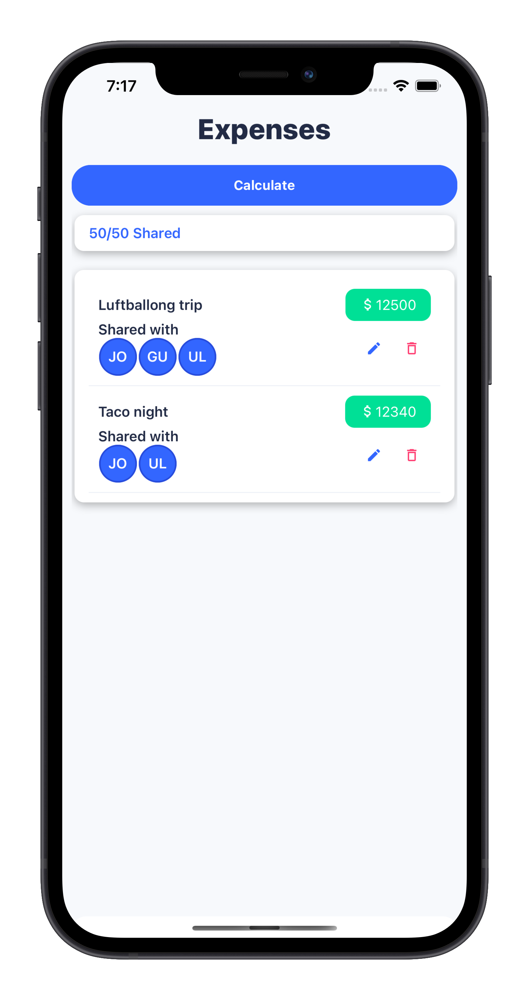

# BillsAI

  
En "hushålls" app utvecklad i React Native, för att b.la kunna hålla koll vad för mat man har i kylskåpet och kunna beräkna hur man ska dela på utgifter.

  
The <i>dev_new</i> branch contains the newest coded

  <h2>Add User Screen</h2>
  
  <h2>Expense Screen</h2>
  
  
  <h2>Payment Screen</h2>
  
  

